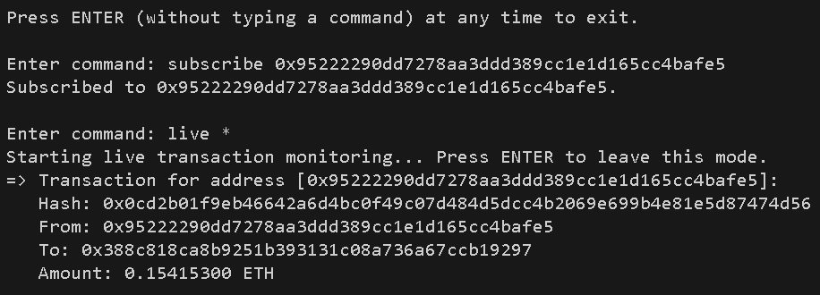

# ETH Transactions Parser CLI
ETH Transactions Parser CLI is a tool designed to parse, store and stream live transactions happening in the Ethereum blockchain for monitored addresses.

## How to run?
```bash
go run main.go
```
## Commands
`subscribe [eth_address]`: monitor transactions for a given Ethereum address.

`get_txs [eth_address]`: get all transactions stored for a given Ethereum address.

`live [*|eth_address]`: show live transactions for all or a specific subscribed Ethereum address.

## Examples
### - Live notifications:
Get the live notifications in the CLI screen for incoming/outgoing transactions of the address `0x95222290dd7278aa3ddd389cc1e1d165cc4bafe5`:
```bash
$ subscribe 0x95222290dd7278aa3ddd389cc1e1d165cc4bafe5`
$ live 0x95222290dd7278aa3ddd389cc1e1d165cc4bafe5
```
You may also want the application to show the live notifications for all the subscribed addresses:
```bash
$ subscribe 0x95222290dd7278aa3ddd389cc1e1d165cc4bafe5`
$ subscribe 0xab97925eb84fe0260779f58b7cb08d77dcb1ee2b`
$ live *
```


## Further Explanations
The application is sub-divided into two main packages: `cli` and `eth_parser`. The `cli` package handles the interfacing with the user, while the `eth_parser` package is the one interfacing with the Ethereum blockchain. 

One can easily make use of the `eth_parser` package functionalities by implementing the `Parser` interface:
```go
type Parser interface {
	GetCurrentBlock() uint64
	Subscribe(address string) bool
	GetTransactions(address string) []Transaction
	Listen() <-chan Transaction // Provides live transactions feed
	Stop()                      // Stops the monitor
}
```

The `Parser` interface provides both polling and push methods - `GetTransactions()` and `Listen()` respectively - to keep track of the subscribed addresses transactions. This interface can be hooked to a notifications service for example, where it would notify for any incoming/outgoing transaction for a given monitored ETH address.

The internal `EthereumParser` instance that implements the `Parser` interface accepts a pluggable storage interface:
```go
type Storage interface {
	Subscribe(address string) bool
	IsSubscribed(address string) bool
	AddTransaction(address string, tx Transaction) bool
	GetTransactions(address string) []Transaction
	SetLastProcessedBlockNum(num uint64) bool
	GetLastProcessedBlockNum() uint64
}
```
By default, a thread-safe memory storage is used, but one may use a different storage mechanism by directly passing it to the instantiation function:
```go
parser := eth_parser.NewEthereumParser(ctx, nil) // Passing nil so it uses the default storage
```

